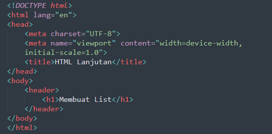
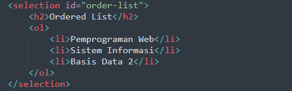
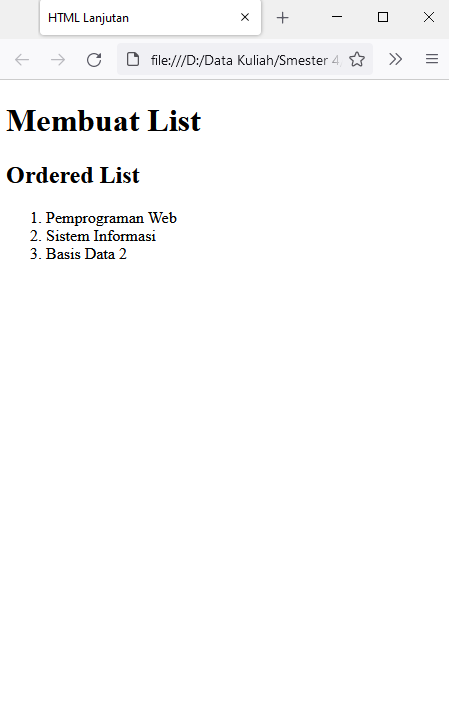
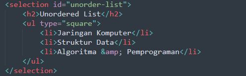

# Praktikum Pemprograman Web
<b>Nama    : Komarudin

NIM     : 312010068

Kelas   : TI.20.D.1</b>

## Belajar Membuat List,Tabel dan Form.
### Langkah-langkah Praktikum
Persiapan membuat dokumen HTML dengan nama file <b>lab3_list.html</b> seperti berikut.

### Membuat Ordered List

  Kemudian tambahkan kode untuk membuat <i>Ordered List</i> seperti berikuat.

 Kemudian masuk browser lalu refresh halaman browser.!

 ### Membuat Unorderd List.
 
   
