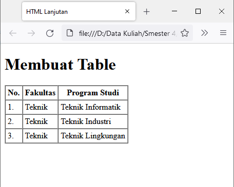

# Praktikum Pemprograman Web
<b>Nama    : Komarudin

NIM     : 312010068

Kelas   : TI.20.D.1</b>

## Belajar Membuat List,Tabel dan Form.
### Langkah-langkah Praktikum
Persiapan membuat dokumen HTML dengan nama file <b>lab3_list.html</b> seperti berikut.

### Membuat Ordered List

  Kemudian tambahkan kode untuk membuat <i>Ordered List</i> seperti berikuat.

 Kemudian masuk browser lalu refresh halaman browser.!

 ### Membuat Unorderd List.

   Kemudian tambahkan kode untuk membuat <i> Unordered List,</i> setelah deklarasi ordered list pada section unordered-list,seperti berikut.

 

 

 ### Membuat Description List

   Kemudian tambahkan kode untuk membuat description list setelah deklarasi unorderd-list.

 

 

 ### Membuat Tabel

 Buat file baru dengan nama <b>lab3_tabel.html</b> seperti berikut.

 

  Kemudian selanjutnya tambahkan kode untuk membuat tabel sederhana seperti berikut:

 

 

  ### Mengatur Margin dan Padding
   Untuk mengatur margin dan padding pada cel data, tambahkan atribut <b>cellpadding</b> dan <b>cellspacing</b> pada tag table.

  

  

  ### Menggabungkan Sel Data

    Untuk menggabungkan sel data, gunakan atribut rowspan dan colspan. Atribut rowspan untuk menggabungkan baris (secara vertikal) dan colspan untuk menggabungkan kolom (secara horizontal).

   

   

  ### Membuat Form

Buat file baru dengan nama <b>lab3_form.html</b> seperti berikut.

   
 
Kemudian selanjutnya tambahkan kode untuk membuat tabel sederhana seperti berikut:

   

   

  ### Menambahkan Style pada Form

 Agar tampilan form lebih menarik,bisa ditambahkan CSS seperti berikut.

   

   

